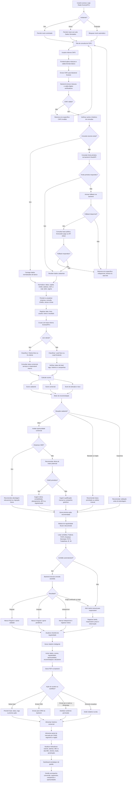

# 01 — Fluxo Principal da Plataforma

Representa o fluxo operacional completo: da consulta do CNPJ até o dashboard estratégico.

```mermaid
flowchart TD
  A["Usuário acessa o app Radar Everest/FK's"] --> B{"Ambiente?"}

  B -->|Dev| C["Permitir mock controlado"]
  B -->|Demo| D["Permitir mock com selo Dados Simulados"]
  B -->|Produção| E["Bloquear mock automático"]

  C --> F["Tela de consulta de CNPJ"]
  D --> F
  E --> F

  F --> G["Usuário informa CNPJ"]
  G --> H["Frontend aplica máscara e valida formato básico"]
  H --> I["Enviar CNPJ para Backend Everest"]

  I --> J["Backend remove máscara e valida dígitos verificadores"]
  J --> K{"CNPJ válido?"}

  K -->|Não| L["Retornar erro específico: CNPJ inválido"]
  L --> F

  K -->|Sim| M["Verificar cache e histórico de consultas"]
  M --> N{"Consulta recente existe?"}

  N -->|Sim| O["Carregar dados normalizados do banco"]
  N -->|Não| P["Consultar fonte primária via backend: BrasilAPI"]

  P --> Q{"Fonte primária respondeu?"}
  Q -->|Sim| R["Receber dados cadastrais"]
  Q -->|Não| S["Acionar fallback via backend"]

  S --> T{"Fallback disponível?"}
  T -->|Sim| U["Consultar base pública, fornecedor pago ou API oficial"]
  T -->|Não| V["Retornar erro específico: indisponível, timeout ou rate limit"]

  V --> F
  U --> W{"Fallback respondeu?"}
  W -->|Não| V
  W -->|Sim| R

  R --> X["Normalizar: datas, capital, CNAE, telefone, CEP, e-mail, QSA, regime"]
  O --> X

  X --> Y["Persistir ou atualizar empresa, consulta, CNAEs, sócios e fonte"]
  Y --> Z["Registrar data, hora, usuário, fonte e resultado"]

  Z --> AA["Cruzar com base interna Everest/FK's"]
  AA --> AB{"Já é cliente?"}

  AB -->|Sim| AC["Classificar: Cliente Ativo ou Ex-cliente"]
  AB -->|Não| AD["Classificar: Lead Novo ou Lead Existente"]

  AC --> AE["Consultar status comercial, serviços e responsável interno"]
  AD --> AF["Verificar status de lead, tags, histórico e campanhas"]

  AE --> AG["Calcular scores"]
  AF --> AG

  AG --> AH["Score cadastral"]
  AG --> AI["Score comercial"]
  AG --> AJ["Score de atenção e risco"]

  AH --> AK["Motor de recomendação"]
  AI --> AK
  AJ --> AK

  AK --> AL{"Situação cadastral?"}
  AL -->|Ativa| AM["Avaliar oportunidade comercial"]
  AL -->|Baixada ou Inapta| AN["Recomendar baixa prioridade ou análise manual"]
  AL -->|Suspensa| AO["Recomendar validação antes de abordagem"]

  AM --> AP{"Empresa é MEI?"}
  AP -->|Sim| AQ["Recomendar abordagem educacional ou migração futura"]
  AP -->|Não| AR["Recomendar oferta de maior potencial"]

  AR --> AS{"CNAE prioritário?"}
  AS -->|Sim| AT["Sugerir oferta: contabilidade, planejamento, BPO ou regularização"]
  AS -->|Não| AU["Sugerir qualificação manual ou campanha genérica"]

  AQ --> AV["Gerar próxima ação recomendada"]
  AT --> AV
  AU --> AV
  AN --> AV
  AO --> AV

  AV --> AW["Módulo de regularidade fiscal e documental"]
  AW --> AX["Listar certidões: Federal, PGFN, Estadual, Municipal, FGTS, Trabalhista, IE, IM"]

  AX --> AY{"Certidão automatizável?"}
  AY -->|Sim| AZ["Backend executa consulta assistida"]
  AY -->|Não| BA["Abrir tarefa manual para responsável"]

  AZ --> BB{"Resultado?"}
  BB -->|Regular| BC["Marcar Regular e salvar validade"]
  BB -->|Irregular| BD["Marcar Irregular e gerar pendência"]
  BB -->|Indisponível| BE["Marcar Indisponível e registrar motivo"]
  BB -->|Exige certificado ou login| BA

  BA --> BF["Registrar tarefa, responsável, prazo e observação"]
  BC --> BG["Atualizar checklist de regularidade"]
  BD --> BG
  BE --> BG
  BF --> BG

  BG --> BH["Gerar relatório inteligente"]
  BH --> BI["Incluir dados, scores, regularidade, oportunidades, recomendação e disclaimer"]
  BI --> BJ["Gerar PDF no backend"]

  BJ --> BK{"Ação do usuário ou workflow?"}
  BK -->|Salvar lead| BL["Persistir lead, status, tags e próxima ação"]
  BK -->|Enviar CRM| BM["Enviar para CRM via backend"]
  BK -->|Enviar por e-mail ou WhatsApp| BN["Distribuir conforme permissão"]
  BK -->|Somente visualizar| BO["Exibir relatório na tela"]

  BL --> BP["Alimentar histórico comercial"]
  BM --> BP
  BN --> BP
  BO --> BP

  BP --> BQ["Alimentar painel de mercado por CNAE, segmento e região"]
  BQ --> BR["Atualizar indicadores: volume, abertas, MEI vs não-MEI, clientes, leads, penetração"]
  BR --> BS["Dashboard estratégico de gestão"]
  BS --> BT["Gestão acompanha conversão, segmentos, campanhas e oportunidades"]
```
