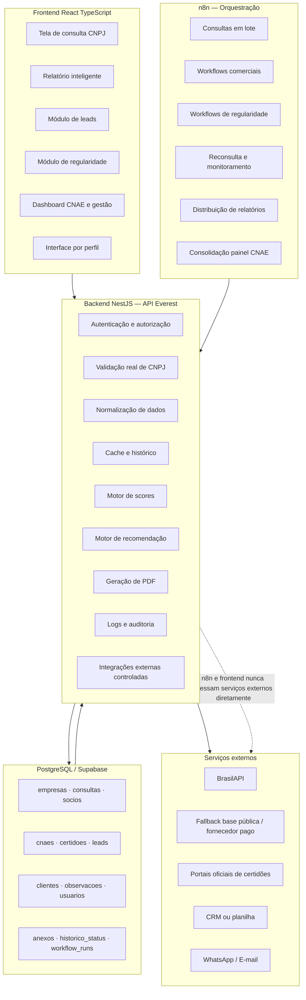

# 02 — Arquitetura de Camadas

## Princípio central
O backend é o único dono de: autenticação, autorização, normalização, cache, logs, permissões, geração de PDF e integrações externas. Frontend e n8n são consumidores da API — nunca acessam serviços externos diretamente.

## Responsabilidades por camada

**Frontend (React + TypeScript)**
- Máscara e validação de formato básico do CNPJ
- Renderização do relatório e do dashboard
- Interface por perfil (Comercial / Contábil / Gestão)
- Consumo da API via React Query / SWR

**Backend NestJS (API Everest)**
- Validação real dos dígitos verificadores
- Normalização de dados (datas, capital, CNAE, telefone, CEP, e-mail, QSA, regime)
- Cache e histórico de consultas
- Motor de scores (cadastral, comercial, atenção/risco)
- Motor de recomendação de próxima ação
- Integrações externas controladas (BrasilAPI, fallbacks, portais, CRM, WhatsApp)
- Geração de PDF
- Autenticação e autorização (Fase 5)
- Logs e trilha de auditoria

**n8n (Orquestração)**
- Consultas em lote
- Workflows comerciais
- Workflows de regularidade
- Reconsulta e monitoramento de mudanças
- Distribuição de relatórios
- Consolidação do painel CNAE
- **Sempre consome a API do backend — nunca acessa serviços externos diretamente**

**Banco de dados (PostgreSQL / Supabase)**
- 12 tabelas: `empresas` · `consultas` · `socios` · `cnaes` · `certidoes` · `leads` · `clientes` · `observacoes` · `usuarios` · `anexos` · `historico_status` · `workflow_runs`

**Serviços externos (acessados exclusivamente pelo backend)**
- BrasilAPI (fonte primária)
- Base pública CNPJ / fornecedor pago / API oficial (fallbacks)
- Portais oficiais de certidões
- CRM ou planilha interna
- WhatsApp
- E-mail

## Diagrama

## Nota sobre o NestJS
Módulos NestJS mapeados para as 5 fases do roadmap:

| Módulo NestJS | Fase de entrada | Responsabilidade principal |
| --- | --- | --- |
| `CnpjModule` | Fase 1 | Validação, consulta, normalização, cache |
| `EmpresaModule` | Fase 1 | Persistência e histórico de empresas |
| `RelatórioModule` | Fase 1 | Geração de PDF |
| `LeadModule` | Fase 2 | Leads, tags, status comercial |
| `ScoreModule` | Fase 2 | Scores cadastral, comercial, atenção |
| `RecomendacaoModule` | Fase 2 | Motor de próxima ação |
| `CertidaoModule` | Fase 3 | Gestor de regularidade |
| `CnaeModule` | Fase 4 | CNAEs prioritários e indicadores de mercado |
| `DashboardModule` | Fase 4/5 | Painel por segmento e gestão |
| `AuthModule` | Fase 5 | Login, perfis, RBAC |
| `AuditoriaModule` | Fase 5 | Trilha completa de auditoria |
