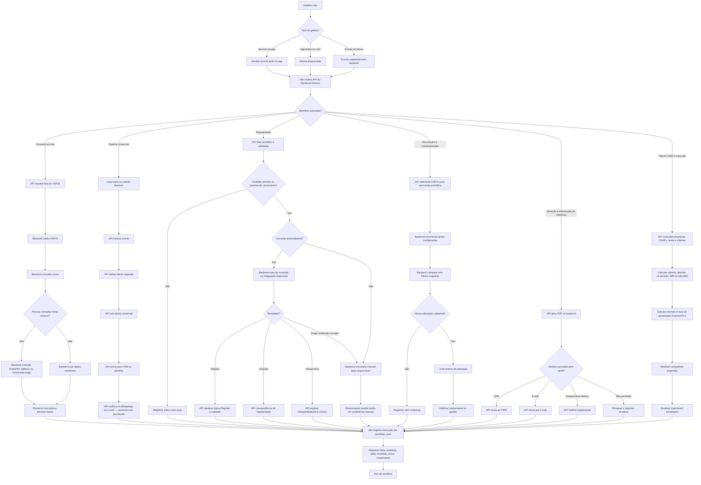

# 03 — Workflows do n8n

## Princípio
O n8n é a camada de orquestração. Nunca acessa BrasilAPI, portais, fornecedores, CRM ou WhatsApp diretamente. Toda chamada passa pela API do backend. Toda execução é registrada em `workflow_runs`.

## Tipos de gatilho

| Gatilho | Quando ocorre |
| --- | --- |
| Manual via app | Usuário aciona ação no frontend (ex: salvar lead, gerar relatório em lote) |
| Agendado / cron | Rotina programada (ex: verificar validade de certidões diariamente) |
| Evento do banco | Backend registra evento que dispara o workflow (ex: lead salvo, cliente fechado) |

## Diagrama completo

## Quando cada workflow entra

| Workflow | Fase de entrada | Gatilho principal |
| --- | --- | --- |
| Consultas em lote | Fase 2 | Manual via app |
| Pipeline comercial | Fase 2 | Evento: lead salvo / cliente fechado |
| Regularidade | Fase 3 | Cron diário |
| Reconsulta e monitoramento | Fase 5 | Cron semanal |
| Distribuição de relatórios | Fase 5 | Manual ou evento |
| Painel CNAE e mercado | Fase 4 | Cron semanal |

## Nota crítica sobre permissões
Os ramos "somente com permissão" e "destino permitido pelo perfil" só passam a valer de fato na Fase 5, quando o sistema de login e perfis estiver ativo. Até lá, os passos de **envio externo de dados ficam desabilitados ou com confirmação manual obrigatória**. Não ligar a saída automática antes de existir autenticação.
