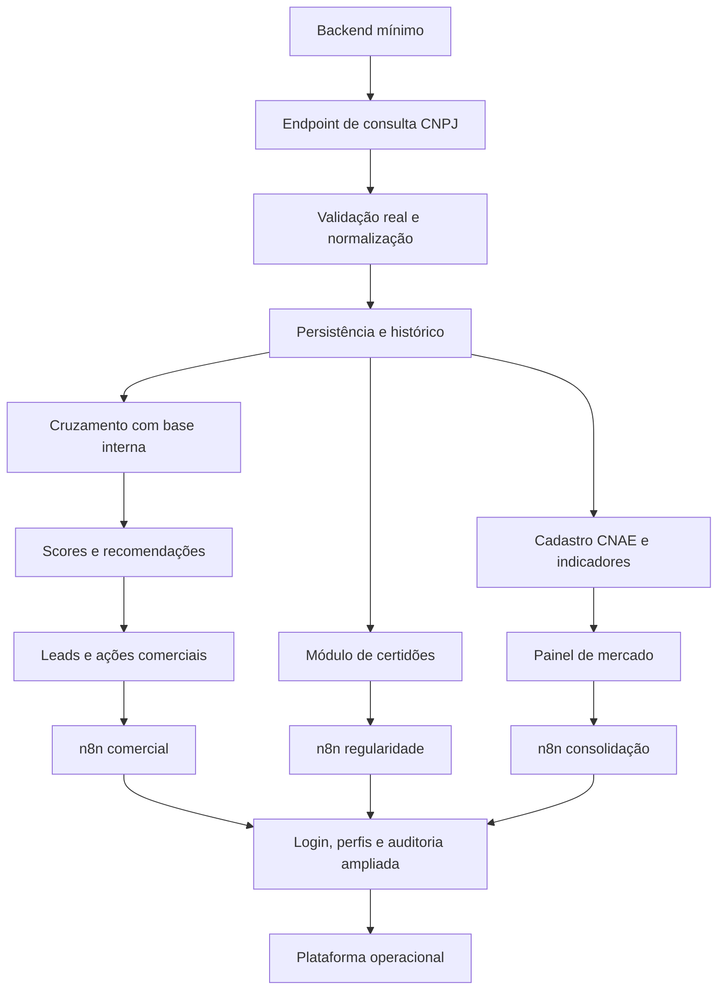

# 04 — Caminho Crítico

## Diagrama

## Bloqueios principais

| # | Bloqueio | O que ele trava |
| --- | --- | --- |
| 1 | **Backend próprio** | Praticamente tudo: normalização, cache, logs, auth, PDF, auditoria, n8n |
| 2 | **Validação e normalização** | Scores e recomendações — dados não padronizados produzem scores inconsistentes |
| 3 | **Persistência (banco)** | Histórico, leads, painel CNAE, auditoria. Sem banco o app é só consulta momentânea |
| 4 | **Base interna de clientes** | Score comercial e motor de recomendação real. Sem cruzamento, o sistema não distingue cliente ativo de lead novo |
| 5 | **API estável** | n8n. Ele entra só na Fase 2 e nunca acessa fontes diretamente |
| 6 | **Módulo de certidões** | Regularidade assistida (Fase 3). Modelar certidão, validade, status, responsável, anexos e pendências antes de automatizar alertas |
| 7 | **Cadastro de CNAEs prioritários** | Painel de mercado útil. Sem ele o dashboard é estatística genérica |
| 8 | **Login e permissões** | Ações sensíveis: envio externo, proposta, distribuição automática. Chegam na Fase 5 — ver mitigação em `CLAUDE.md` Decisão #1 |

## O que pode ser paralelizado

| Frente | Paralelo com | Observação |
| --- | --- | --- |
| UI/UX do relatório | Backend mínimo | Definir contratos de dados primeiro |
| Validador de CNPJ | Criação do backend | Pode ser `util` compartilhado frontend/backend |
| Disclaimers e links oficiais | Normalização | Baixa dependência técnica |
| Testes de componentes | Refatoração TypeScript | Evoluem juntos |
| Modelagem do banco | Backend mínimo | Fazer cedo — desbloqueia persistência |
| Regras iniciais de score | Integração base interna | Começar com regras simples, refinar depois |
| Layout do PDF | Motor de geração | Usar mock de dados normalizados |
| Cadastro de CNAEs prioritários | Fase 2 | Pode ser preparado antes da Fase 4 |
| Desenho dos workflows n8n | Final da Fase 1 | Implementação só após API estável |
| Política de permissões | Antes do login completo | Desenhar conceitualmente já na Fase 2 |

## Decisão mais arriscada do projeto
A integração com a base interna de clientes (Fase 2, tarefa 2) é a de maior incerteza. O formato e a qualidade da base determinam se é uma tarefa M ou um subprojeto. **Mapear a fonte real antes de estimar o esforço da Fase 2.** Ver `CLAUDE.md` Decisão #2.
