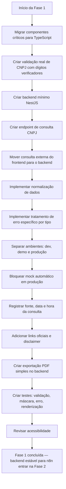

# Fase 1 — MVP Confiável

**Objetivo:** parar de ser demonstração e virar ferramenta interna segura.
**n8n:** não entra nesta fase. O n8n depende de backend estável — que é exatamente o que esta fase entrega.

## Resultado esperado
A equipe consegue consultar CNPJs com segurança, gerar relatório preliminar confiável e exportar PDF simples. Nenhum mock em produção.

## Fluxograma de entregas



## Checklist de entregas

- [x] Migração crítica do frontend para TypeScript
- [x] Validador real de CNPJ (dígitos verificadores)
- [x] Backend NestJS mínimo rodando
- [x] Endpoint de consulta CNPJ
- [x] Consulta externa movida para o backend (frontend não acessa BrasilAPI)
- [x] Normalização: datas, capital social, CNAE, telefone, CEP, e-mail, QSA ausente, Simples/MEI ausente
- [x] Tratamento de erro específico: CNPJ inválido, inexistente, timeout, rate limit, 5xx, CORS, parsing, campo ausente
- [x] Separação dev / demo / produção
- [x] Mock removido em produção; mock com selo em demo
- [x] Data, hora e fonte registrados em toda consulta
- [x] Links oficiais e disclaimer no relatório
- [x] Exportação PDF simples gerada no backend
- [x] Testes unitários e de interface
- [x] Acessibilidade: aria-label, aria-live, navegação por teclado, contraste

## Tipos de erro que devem existir ao final desta fase
```
CNPJ inválido — verifique os dígitos.
CNPJ não encontrado na base consultada.
Serviço externo indisponível.
Consulta excedeu o tempo limite.
Dados retornados incompletos.
Não foi possível consultar agora. Tente novamente.
```

## Comportamento de ambiente
| Ambiente | Falha da API | Ação |
| --- | --- | --- |
| Desenvolvimento | API falhou | Exibe mock |
| Demonstração | API falhou | Exibe mock com selo "dados simulados" |
| Produção | API falhou | Exibe erro claro — não gera relatório |
