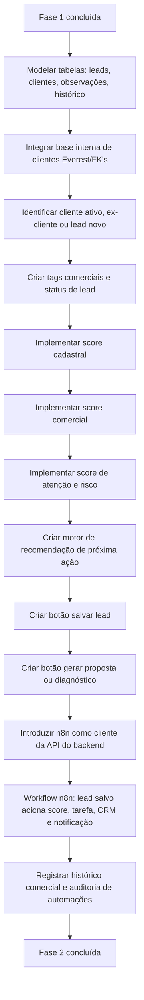

# Fase 2 — Inteligência Comercial

**Objetivo:** transformar consulta em oportunidade.
**n8n:** entra nesta fase — primeiro workflow sobre API estável da Fase 1.
**Pré-requisito crítico:** resolver Decisão #2 (base de clientes) antes de iniciar. Ver `CLAUDE.md`.

## Resultado esperado
A equipe sabe quem abordar, com qual argumento e qual serviço oferecer. O n8n dispara a cadeia comercial automaticamente ao salvar um lead.

## Checklist de entregas

- [x] Modelar tabelas: leads, clientes, observações, histórico (entidades TypeORM criadas)
- [ ] Integrar base interna de clientes Everest/FK's — **bloqueada: Decisão #2 (onde está a base?)**
- [ ] Identificar cliente ativo, ex-cliente ou lead novo — **bloqueada: depende da tarefa 2 (base de clientes)**
- [x] Criar tags comerciais e status de lead — enum + `PATCH /leads/:id/status` + seletor na UI
- [x] Implementar score cadastral
- [x] Implementar score comercial
- [x] Implementar score de atenção e risco
- [x] Criar motor de recomendação de próxima ação
- [x] Criar botão salvar lead (frontend + backend)
- [x] Criar botão gerar proposta ou diagnóstico — `GET /leads/:id/proposta` + modal no frontend
- [x] Introduzir n8n como cliente da API do backend — `POST /cnpj/lote` + `WorkflowRunsModule` (POST/PATCH/GET `/workflow-runs`)
- [ ] Workflow n8n: configurar workflows no n8n apontando para a API (ver docs/arquitetura/03-workflows-n8n.md)

## Fluxograma de entregas

## Os três scores

### Score cadastral — qualidade dos dados
Critérios: CNPJ válido, empresa ativa, endereço completo, telefone disponível, e-mail disponível, CNAE informado, QSA retornado, data de abertura, capital social, porte.
Exemplo: *Score cadastral: 82/100 — Cadastro consistente, certidões ainda não verificadas.*

### Score comercial — potencial de venda para Everest/FK's
Critérios: CNAE prioritário, não ser MEI, porte, idade da empresa, segmento, localização, aderência a serviços, presença na base interna, ticket potencial.
Exemplo: *Score comercial: 91/100 — Alta aderência para troca de contabilidade e diagnóstico tributário.*

### Score de atenção/risco
Critérios: situação cadastral diferente de ativa, empresa muito recente, ausência de QSA, ausência de contato, certidões não verificadas, CNAE sensível, capital incompatível.
Exemplo: *Score de atenção: 63/100 — Exige validação de certidões antes de proposta.*

## Recomendações automáticas por caso
| Caso | Recomendação gerada |
| --- | --- |
| Empresa ativa, CNAE prioritário, não cliente | Abordagem comercial consultiva |
| Empresa MEI | Abordagem educacional — potencial migração MEI → ME |
| Empresa baixada | Não priorizar. Manter registro histórico |
| Empresa sem certidões | Diagnóstico de regularidade antes da proposta |
| Empresa já cliente | Encaminhar para responsável interno. Verificar oportunidades FK's |

## Nota sobre envio externo (CRM, WhatsApp, e-mail)
O login só chega na Fase 5. Enquanto isso, os passos de envio externo ficam **desabilitados ou com confirmação manual obrigatória**. Orquestração pode ser construída; saída automática de dados só ligada com autenticação ativa.
