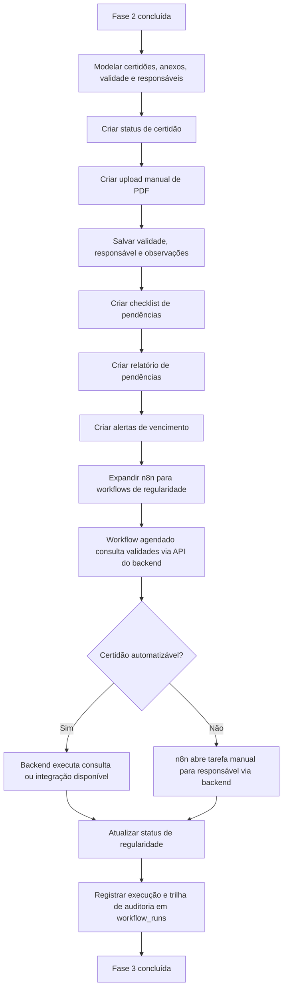

# Fase 3 — Regularidade Assistida

**Objetivo:** organizar validação fiscal e documental.
**n8n:** expande — workflows agendados de validade e alertas.

## Resultado esperado
O sistema ajuda no pré-onboarding, regularização e controle de documentação. A equipe sabe quais certidões estão vencidas, quais precisam de atenção e quem é o responsável por cada pendência.

## Fluxograma de entregas



## Status possíveis de cada certidão
| Status | Significado |
| --- | --- |
| Não consultada | Ainda não foi verificada |
| Consulta manual necessária | Requer acesso ao portal com certificado/login |
| Regular | Consultada e dentro da validade |
| Irregular | Consultada e com pendência identificada |
| Indisponível | Portal fora do ar ou sem retorno |
| Exige certificado / login | Não automatizável sem acesso específico |

## Certidões cobertas
- CND Federal / Receita Federal / PGFN
- Dívida Ativa da União
- Certidão Estadual
- Certidão Municipal
- FGTS / CRF
- Trabalhista
- Inscrição Estadual (IE)
- Inscrição Municipal (IM)

## Nota crítica sobre automação
Na prática brasileira, quase nenhuma dessas certidões tem API pública limpa. A maioria exige captcha, certificado digital A1/A3 ou navegação manual em portal gov.br / e-CAC. O módulo nasce como **gestor de regularidade** — não como emissor automático. O valor imediato está em:
- Organizar o processo
- Centralizar o controle de validade
- Alertar vencimentos
- Atribuir responsáveis
- Gerar checklist para o consultor

A automação real de consulta vem devagar, à medida que integrações viáveis forem identificadas caso a caso.

## Fluxo de onboarding de cliente (visão futura integrada)
Quando uma empresa sai de lead e vira cliente, a mesma base alimenta:
```
Lead consultado → Diagnóstico preliminar → Proposta → Cliente fechado
→ Checklist de onboarding → Coleta de documentos
→ Consulta de certidões → Configuração fiscal/contábil → Acompanhamento
```
