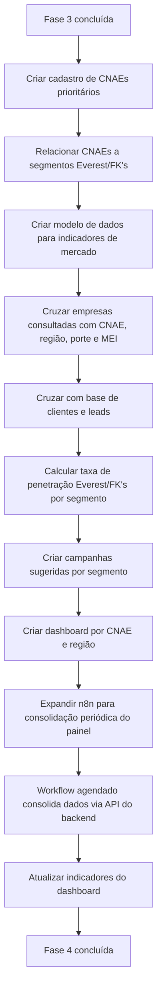

# Fase 4 — Painel CNAE e Mercado

**Objetivo:** transformar dados em estratégia de prospecção.
**n8n:** consolida o painel periodicamente via cron.

## Resultado esperado
A gestão decide onde prospectar e quais segmentos priorizar com base em dados reais de mercado cruzados com a carteira da Everest/FK's.

## Fluxograma de entregas



## Como a consulta individual alimenta o painel
Ao consultar uma empresa, o sistema identifica o CNAE e responde internamente:

- Esse CNAE está na lista de segmentos monitorados?
- Quantas empresas desse CNAE existem na cidade/UF?
- Quantas abriram recentemente?
- Quantas são MEI?
- Quantas já são clientes Everest/FK's?
- Qual é a taxa de penetração da Everest nesse segmento?
- Há campanha ativa para esse CNAE?

A consulta individual vira uma peça dentro da inteligência de mercado.

## Indicadores do painel
- Volume de empresas por CNAE e região
- Empresas abertas por período (últimos 3/6/12 meses)
- MEI vs. não-MEI por segmento
- Clientes Everest/FK's por CNAE
- Taxa de penetração por segmento
- Leads prioritários por CNAE
- Campanhas ativas por segmento

## Exemplo de insight gerado
```
Campanha: Clínicas odontológicas em Salvador
CNAE: 8630-5/04
Empresas abertas nos últimos 12 meses: 320
MEIs: 80 | Não MEIs: 240
Clientes Everest/FK's: 12
Leads prioritários: 65
Oferta sugerida: Contabilidade especializada + planejamento tributário
```

## Visão do fluxo estratégico
```
Consulta CNPJ → Identifica CNAE → Cruza com painel de mercado
→ Cruza com base de clientes → Gera oportunidade comercial
→ Alimenta dashboard estratégico
```
