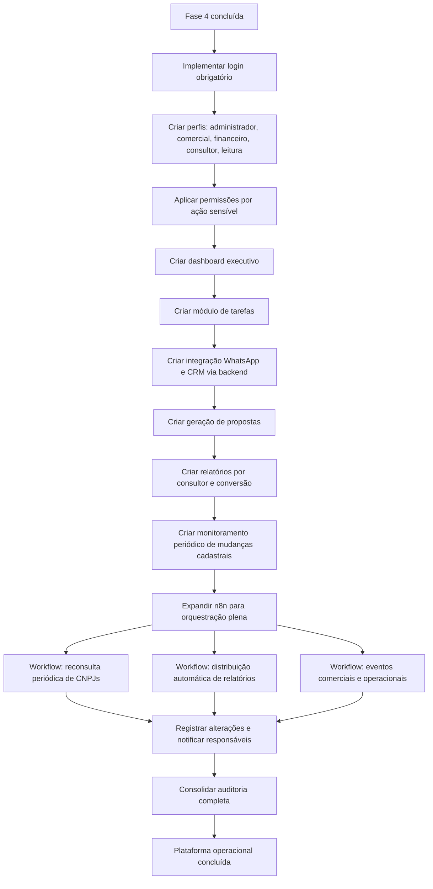

# Fase 5 — Plataforma Operacional

**Objetivo:** virar sistema central de inteligência comercial e cadastral da Everest/FK's.
**n8n:** orquestração plena — reconsulta, monitoramento de mudanças, distribuição automática de relatórios.
**Login e perfis:** chegam nesta fase.

## Resultado esperado
A ferramenta deixa de ser consulta e vira processo comercial completo. Toda ação sensível é controlada por perfil. Toda execução é auditável.

## Fluxograma de entregas

## Perfis de acesso

| Perfil | Acesso principal |
| --- | --- |
| Administrador | Tudo, incluindo configurações, usuários e auditoria |
| Comercial | Consulta, leads, propostas, WhatsApp, CRM |
| Financeiro | Relatórios, histórico, exportação |
| Consultor | Consulta, certidões, checklist, observações |
| Somente leitura | Visualização sem edição ou envio |

## Ações que exigem permissão de perfil
- Envio de dados para CRM
- Notificação via WhatsApp ou e-mail
- Geração e distribuição automática de relatórios
- Exclusão de registros
- Configuração de workflows n8n
- Acesso à trilha de auditoria completa
- Geração de propostas

## Perguntas que o dashboard executivo responde
- Quantos CNPJs foram consultados este mês?
- Quantos viraram leads? Quantos viraram clientes?
- Quais CNAEs aparecem mais nas consultas?
- Quais consultores mais consultam?
- Quais segmentos têm maior conversão?
- Quais empresas estão com certidões vencendo?
- Quais oportunidades estão paradas há mais de X dias?

## Monitoramento de mudanças cadastrais
O n8n reconsulta periodicamente CNPJs já na base e detecta alterações em: situação cadastral, QSA (sócios), endereço, regime tributário, capital social. Gera evento e notifica responsável. Permite comparar qualquer empresa com seu último snapshot.

## Auditoria completa
Ao final desta fase, o sistema registra:
- CNPJ consultado
- Usuário que consultou
- Data, hora e fonte
- Resultado obtido
- Score calculado
- Status comercial
- Observações
- Certidões e anexos
- Tarefas criadas
- Alterações cadastrais detectadas
- Workflows executados (`workflow_runs`)
- Tentativas de ação não permitida pelo perfil
